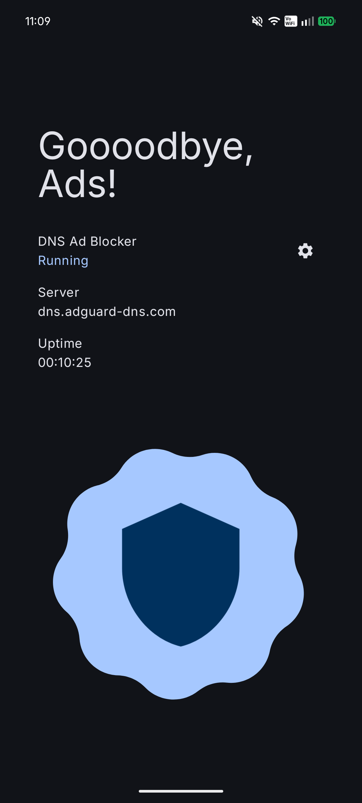
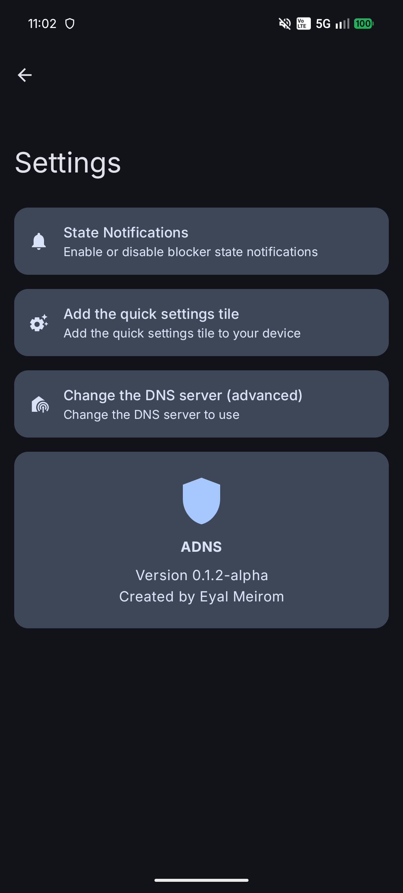

# ADNS

ADNS is a DNS-based ad blocker for Android. No VPN, no background services, no battery drain, no hassle.

Download from [Releases](https://github.com/eyalm2000/adns/releases).
## Activation

ADNS writes to global DNS settings, which requires elevated access for `WRITE_SECURE_SETTINGS`.

This app supports activation via:

- [Shizuku](https://github.com/RikkaApps/Shizuku)
- ADB shell (manual)

 
 

  
  

