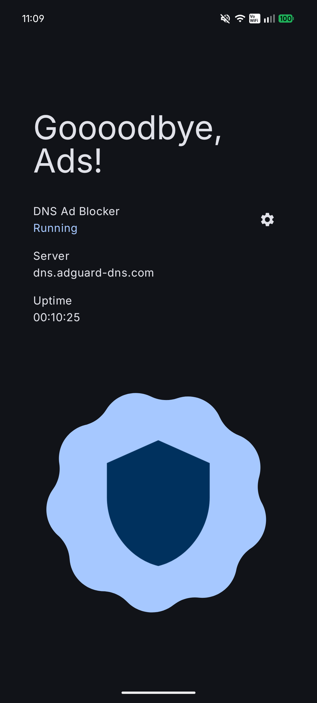
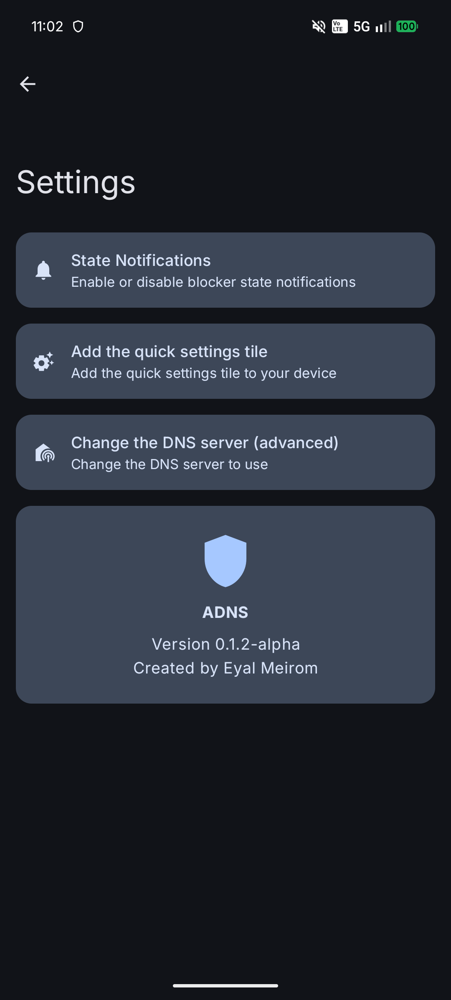

## Overview

ADNS combines a feature-rich Private DNS client for Android with a native NextDNS integration, giving you full control over your device's DNS settings and your NextDNS account.

Download it from [GitHub Releases](https://github.com/eyalm2000/adns/releases) or [IzzyOnDroid](https://apt.izzysoft.de/fdroid/index/apk/com.eyalm.adns).

Visit the [website](https://adns.eyalm.dev/) or check out the [user guide](https://adns.eyalm.dev/docs/).

## Three Ways To Use ADNS

### 1. Private DNS Client

Use ADNS as a fast Private DNS controller when you want direct control over system DNS without using a VPN. Requires a one-time Shizuku or ADB setup.

- Turn Private DNS on or off with a single tap
- Apply automatic Wi-Fi rules for specific networks
- State notifications so you can quickly see whether DNS is active
- Quick Settings tile for instant toggle access
- Choose your preferred provider and filtering options when supported (ads, trackers, malware, adult content, and safe search)
- Supported providers include AdGuard, Cloudflare, Google, Quad9, OpenDNS, NextDNS, and custom hostnames

### 2. Native NextDNS Dashboard

Use ADNS as a full NextDNS app when you want to manage your account without opening a web dashboard. Requires a NextDNS account (no Shizuku or ADB needed).

- View and edit every NextDNS profile setting right from the app
- Inspect NextDNS logs and detailed statistics
- View NextDNS setup guides for all devices and platforms
- 100% native Android experience - no WebViews involved

### 3. NextDNS + Private DNS Integration

Use ADNS to link your NextDNS account directly to your device's DNS settings and keep both sides in sync. Requires a one-time Shizuku or ADB setup.

- Seamless integration with all ADNS features (Wi-Fi rules, notifications, and Quick Settings tile)
- Automatic NextDNS setup handled entirely for yo
- Custom device name support (appears in your NextDNS dashboard, statistics, and logs)
- One-click NextDNS profile switching that updates the system DNS settings for you

## Screenshots

 

    
    
    

    
    
    

 

## Privacy & Security

ADNS is built with zero telemetry or tracking.

#### Reproducible Builds

ADNS supports Reproducible Builds. An independent server compiles the open-source code from this repository and compares the resulting binary against the published release APKs. 

A passing status proves that the APK you download from GitHub or IzzyOnDroid was generated directly from this exact source code, guaranteeing that no hidden code, backdoors, or credential-stealing modifications were injected during compilation.  

#### Credential & API Key Safety

- No personal data or credentials are ever collected or sent to third-party servers.
- If you log in with your NextDNS username and password, they are used a single time to generate an API key. Your password is never stored.
- Your NextDNS API key is stored encrypted on your device and is only transmitted directly to official NextDNS API endpoints.  

#### Build Flavors & Network Activity

ADNS is available in two build flavors:

- **FOSS Flavor:** Completely clean network profile. It contains no update checker and makes zero external requests other than direct communication with your configured DNS provider and NextDNS.
- **Normal Flavor:** Makes a single background API request to GitHub on app launch to check for new releases.

## Localization

Help make ADNS available in your language via [Weblate](https://hosted.weblate.org/engage/adns/).  

  
  
Translation Components:  

1. **adns-xml-strings**  
These are the main UI strings used in the app. Focus on this component first if you want to contribute.

2. **nextdns-strings**  
These are imported from NextDNS for the app settings. Most languages are already at 100 percent because official translations were imported. This is a very large set of strings and includes web dashboard text not used in the app, so only work on this if you want to translate a huge dataset. If you translate these, you'll have my huge kudos, and please consider submitting them to NextDNS as well :)  

## Frequently Asked Questions

#### Will you add DNS-over-HTTPS or VPN mode?

No. ADNS is specifically built to leverage Android's native Private DNS engine (DNS-over-TLS) without running a background VPN service. Running a local VPN engine consumes extra battery, takes up system memory, and prevents you from using other VPN apps. 

For local VPN-based filtering, apps like [AdAway](https://github.com/adaway/adaway) or [BlockAds](https://github.com/pass-with-high-score/blockads-android) are better and more customizable. For NextDNS users who want DoH, [RethinkDNS](https://github.com/celzero/rethink-app) is the answer.

#### Will you add native Root support?

No. ADNS manages system settings cleanly via Shizuku or ADB. If your device is rooted, you can easily start Shizuku in root mode with a single tap. 

For deep system-level hosts file patching or dedicated root workflows, apps like [AdAway](https://github.com/adaway/adaway) or [BlockAds](https://github.com/pass-with-high-score/blockads-android) already specialize in that functionality.

#### Does Shizuku need to run in the background all the time?

No. After onboarding, the app doesn't use Shizuku at all.

## Build From Source

Build using the Gradle wrapper from the project root:

- Windows: `gradlew.bat assembleDebug`
- macOS/Linux: `./gradlew assembleDebug`

## Disclaimer

ADNS is an independent project and is not affiliated with NextDNS in any way.

## License

This project is licensed under the MIT License. See [LICENSE](LICENSE).
